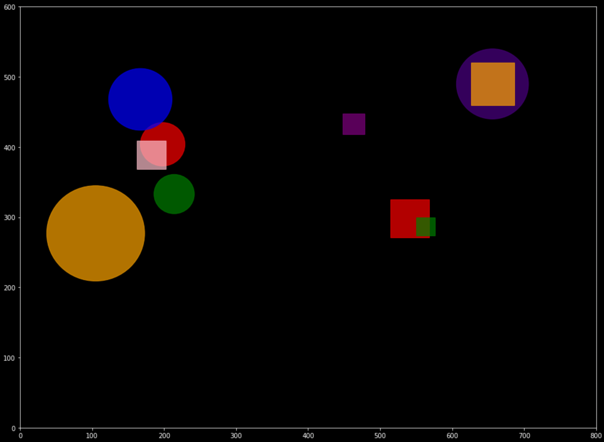

## Assignment 2

Implement collision detection functions for various objects given in the [input.csv](input.csv) file. The [input.csv](input.csv) file is of the following format.

| ShapeID | ShapeType | CenterX | CenterY | Radius/Length |
| --- | --- | --- | --- | --- |
| 1 | 0 | 198 | 404 | 31 |
| 2 | 0 | 656 | 490 | 50 |
| . | . | . | . | . |
| . | . | . | . | . |
| . | . | . | . | . |
| 6 | 1 | 182 | 389 | 40 |
| . | . | . | . | . |

Here **ShapeType** indicates whether the **Object** has the shape of a Circle (indicated by 0) or a Square (indicated by 1). Input all the objects from the file and check for collision detection among the pair of objects according to their shapes and other specifications. The output should display '1' when collision occurs and '0' when collision does not occur and should be of the following format. 

```
0   0   1   0   1   0   0   0   0
0   0   0   0   1   0   0   0
.
.
.
0   0
1
```
Here the first line indicates whether the **Object** with **ShapeId** 1 collides with **Object**(s) with **ShapeId** 2 to 10. Here each output (1 or 0) is separated by a tab space. Then the next line indicates whether the Object with **ShapeId** 2 collides with **Object**(s) with **ShapeId** 3 to 10 and so on. 

**Use both, switch case and function dispatch, for finding collision between various shapes.**

<hr>

*Hint: The shapes, when plotted, look something like this.*



